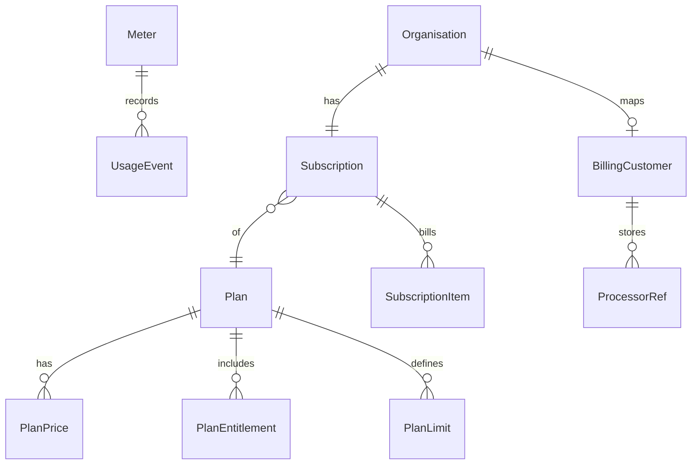

# Billing plans — pricing models & payment processor interface

Status: **design / decision doc** (Phase C precursor).  
Context: catalog + subscription/entitlements already live in KYC; Stripe Checkout/Portal/webhooks are not wired yet ([saas-rethink.md](./saas-rethink.md) gap #5).

## Goal

KYC is **not a payment processor**. It is a **strong implementor/executor** of a PSP’s APIs (Stripe first): checkout, portal, webhooks, usage reporting, and reconciliation — so companies can fall back on KYC APIs instead of wiring Stripe themselves.

Alongside that:

1. Keep **KYC as system of record** for org → plan → entitlements / access.
2. Treat **Stripe (or any PSP)** as the money rail via a replaceable adapter; never as the source of truth for product access.
3. Support evolution from simple fixed SaaS pricing to metered / hybrid without rewriting merchant-facing KYC APIs.

### Product stance

| We are | We are not |
| --- | --- |
| Executor of Checkout, Portal, Customers, Subscriptions, Meters | Merchant of record for arbitrary third-party commerce (unless Connect later) |
| Webhook verify + idempotent reconcile → org subscription/entitlements | Invoicing, tax filing, payout, or card vault of our own |
| Stable KYC billing APIs companies call instead of Stripe SDK | A second Stripe / Adyen / Braintree |

Companies integrate **KYC**; KYC integrates **Stripe**.

---

## Principles

| Principle | Meaning |
| --- | --- |
| Executor, not PSP | Call processor APIs well; do not reimplement money movement, ledgers, or PCI. |
| Org is the billable entity | One billing customer per organisation (no separate Account in v1). |
| Entitlements gate product | Paid state updates subscription + entitlements; handlers check entitlements, not Stripe. |
| Catalog owns commercial intent | Plan key, included entitlements, pricing shape, and limits live in KYC. |
| Processor owns money movement | Checkout, invoices, payment methods, tax, dunning stay with the PSP. |
| Idempotent sync | Webhooks / pollers map processor events → KYC subscription state with idempotency keys. |
| Soft coupling | KYC stores opaque processor refs (`customer_id`, `subscription_id`, `price_ids`); never encode Stripe-only enums in core domain. |
| Merchant-facing stability | Companies depend on KYC billing routes; adapter details may change underneath. |

---

## Pricing model catalog (all options)

Think in two layers:

1. **Commercial shape** — how the merchant is charged.
2. **Access shape** — what the org may use (entitlements + numeric limits).

These are independent. A “Pro” plan can be fixed-price with soft limits, or fixed base + usage overage on the same entitlements.

### A. Fixed amount (recurring)

| Variant | Description | Typical use |
| --- | --- | --- |
| **Flat subscription** | Fixed price per period (month/year). | Classic SaaS tiers. |
| **Seat-based (licensed)** | Fixed price × quantity (seats/members). Quantity set at checkout or updated later. | Team products. |
| **Tiered seats** | Volume tiers on seat count (e.g. 1–10 @ $X, 11–50 @ $Y). | Growing teams. |
| **Package / prepaid credits** | Pay fixed amount for a credit pool that expires or rolls. | Predictable spend with burst room. |
| **One-time / lifetime** | Single charge, long-lived access. | Rare for B2B; keep optional. |
| **Annual prepay discount** | Same entitlements; different billing interval price. | Cash / retention. |

**KYC mapping:** Plan + Subscription period; optional `quantity` (seats). Entitlements boolean; limits via separate limit keys (below).

### B. Per-usage (metered)

| Variant | Description | Typical use |
| --- | --- | --- |
| **Pure metered** | Bill only for reported usage (API calls, checks, MAUs, storage GB). | Infrastructure-ish APIs. |
| **Included + overage** | Flat fee includes N units; overage per unit. | Most B2B SaaS. |
| **Tiered usage** | Unit price falls as volume rises. | High-volume APIs. |
| **Graduated / volume pricing** | Stripe-style graduated vs volume aggregation. | Cost-sensitive APIs. |
| **Multiple meters** | Separate prices for distinct dimensions (e.g. `api_calls` + `email_sends`). | Multi-product platforms. |
| **Prepaid usage wallet** | Credits drawn down by meters; top-up when low. | Predictable spend + metered burn. |

**KYC mapping:** Meter definitions + usage events (source of truth for *what happened*); processor invoices from aggregated usage (source of truth for *what was charged*). Entitlements may still gate features; meters enforce/bill quantity.

### C. Hybrid (recommended default for later stages)

| Pattern | Formula | Why |
| --- | --- | --- |
| **Base + usage** | Fixed subscription + metered overage | Predictable floor + upside. |
| **Base + seats + usage** | Platform fee + seat fee + meter | Matches org/user/API reality. |
| **Entitlement packs add-ons** | Core plan + purchasable add-on plans/prices | Sell SSO, branding, higher limits without new base tiers. |
| **Enterprise override** | Negotiated price / custom entitlements; invoice outside self-serve | Sales-led deals. |

### D. Commercial modifiers (orthogonal)

| Modifier | Notes |
| --- | --- |
| **Trial** | Time-boxed `trialing` subscription; already in status enum. |
| **Freemium / free plan** | `$0` plan with limited entitlements; no processor required until upgrade. |
| **Coupons / promo codes** | Prefer processor-native (Stripe Coupons/Promotion Codes) via checkout session params. |
| **Minimum commit** | Contractual floor on usage; may be invoice line or custom agreement. |
| **Soft vs hard limits** | Soft: allow + bill overage. Hard: 429 / entitlement deny at quota. |
| **Grace / past_due** | Keep read access; restrict writes while `past_due`. |
| **Tax / VAT** | Processor Tax / external tax; KYC stores address on org when needed. |
| **Multi-currency** | Catalog prices per currency; org billing currency locked at customer create. |

### E. What we should *not* invent early

- Marketplace split payouts / Connect (unless you sell through partners).
- Per-end-user consumer billing (KYC bills organisations).
- In-app ledger that reimplements invoicing (keep a thin usage ledger; let PSP invoice).

---

## Recommended commercial ladder (product view)

Start simple; keep schema ready for meters.

| Tier | Pricing shape | Access |
| --- | --- | --- |
| **Free / Trial** | $0 or time-boxed trial | Core entitlements, hard low limits |
| **Team** | Fixed monthly/annual (± seats) | Full merchant product, soft/hard member limits |
| **Growth** | Fixed + included usage + overage | Higher limits; metered API/email/etc. |
| **Enterprise** | Custom / invoice | Overrides via `organisation_entitlements`; optional offline payment |

Exact names/prices are product decisions; the **shapes** above are what the system must support.

---

## Domain model extensions (KYC-owned)

Keep existing objects; add only what pricing needs.



### New / extended concepts

| Concept | Purpose |
| --- | --- |
| **PlanPrice** | Commercial offer attached to a plan: `model` (`flat` \| `per_unit` \| `tiered` \| `metered`), `interval`, `currency`, `unit_amount`, optional `meter_key`, `processor_price_ref`. |
| **PlanLimit** | Numeric caps: e.g. `members.max=25`, `api_calls.included=10000`. Soft/hard flag. |
| **Meter** | Usage dimension: `key`, aggregation (`sum`/`max`), unit label. |
| **UsageEvent** | Append-only: org, meter, quantity, occurred_at, idempotency_key, source. |
| **BillingCustomer** | Org ↔ processor customer mapping + default currency/email. |
| **SubscriptionItem** | Line items under subscription (base price, seat price, meter price). |
| **ProcessorEvent** | Inbox for webhooks (id, type, payload hash, processed_at) for idempotency. |

### Effective access (unchanged idea)

```text
effective_entitlements = plan ∪ grants − denies
effective_limits       = plan limits ± overrides
allowed(feature)       = entitlement + (usage < hard_limit if any)
```

Money and access stay separated: failing payment → subscription status change → access policy; never “call Stripe inside every check”.

---

## Payment processor interface

Stripe first; design as a **port** with one adapter.

### Port (KYC → processor)

```go
// Conceptual — names illustrative
type PaymentsProcessor interface {
    EnsureCustomer(ctx, CustomerInput) (CustomerRef, error)
    CreateCheckout(ctx, CheckoutInput) (CheckoutSession, error)      // subscribe / upgrade
    CreatePortal(ctx, PortalInput) (PortalSession, error)            // payment method / cancel
    ReportUsage(ctx, UsageReport) error                             // metered price usage records
    GetSubscription(ctx, SubscriptionRef) (RemoteSubscription, error)
    // Optional later:
    // CreateInvoice, ApplyCoupon, CancelSubscription, ListInvoices
}

type WebhookHandler interface {
    ParseAndVerify(headers, body) (ProcessorEvent, error)
    // Application maps ProcessorEvent → domain commands
}
```

### Responsibilities split

| KYC (core) | Adapter (Stripe) | Out of band |
| --- | --- | --- |
| Plan catalog, entitlements, limits | Product/Price IDs | Tax filings |
| Org subscription status | Checkout, Customer Portal | Chargebacks UI |
| Usage event ingest + aggregation | Usage records / Billing Meters | Accounting export |
| Entitlement checks | Webhook signature verify | Support refunds in Dashboard (v1 OK) |
| Idempotent apply of remote state | Map Stripe objects ↔ refs | |

### Event → domain mapping (adapter-agnostic outcomes)

| Outcome command | Typical Stripe triggers |
| --- | --- |
| `CustomerLinked` | `customer.created` / checkout completed |
| `SubscriptionActivated` | `checkout.session.completed`, `customer.subscription.created/updated` |
| `SubscriptionPeriodRenewed` | `invoice.paid` |
| `SubscriptionPastDue` | `invoice.payment_failed` |
| `SubscriptionCanceled` | `customer.subscription.deleted` |
| `UsageAccepted` | (internal) after successful report — or meter errors |

Core code should apply **these commands**, not raw Stripe event types.

### Config surface

```text
PAYMENTS_PROVIDER=stripe|noop
STRIPE_SECRET_KEY=
STRIPE_WEBHOOK_SECRET=
STRIPE_SUCCESS_URL=
STRIPE_CANCEL_URL=
# Price IDs live in DB on PlanPrice.processor_price_ref, not only in env
```

`noop` provider: local/dev — manually set subscription via existing platform APIs.

---

## Stripe mapping (v1 adapter)

| KYC | Stripe |
| --- | --- |
| Organisation | Customer (`metadata.org_id`) |
| PlanPrice (flat) | Price (`recurring`) on Product |
| PlanPrice (seats) | Price with `per_unit` + subscription quantity |
| PlanPrice (metered) | Price with `meter` / legacy usage-record price |
| Meter usage | Billing Meter events or subscription item usage records |
| Self-serve subscribe/upgrade | Checkout Session (`mode=subscription`) |
| Manage card / cancel / invoices | Customer Portal |
| Truth for paid state | Webhooks → KYC Subscription |

**Rules of engagement with Stripe:**

- Create Products/Prices in Stripe (Dashboard or Terraform); store Price IDs on `PlanPrice`.
- Do not invent a second invoice system.
- Prefer Checkout + Portal over custom card UI in v1.
- Sync subscription status from webhooks; treat KYC manual `PUT …/subscription` as platform/ops override (enterprise / comps).

---

## Metering design (when you add usage)

### Ingest path

```text
Product action → UsageEvent (idempotent) → aggregator →
  (optional) enforce hard limit →
  (async) PaymentsProcessor.ReportUsage
```

### Meter candidates for this product

| Meter key | Unit | Notes |
| --- | --- | --- |
| `members.active` | seats | Often licensed (quantity), not pure meter |
| `api_calls` | count | Platform / check APIs |
| `authz_checks` | count | High volume; sample or aggregate carefully |
| `email_sends` | count | Once email delivery ships |
| `app_users.active` | MAU | If you monetize end-user records |
| `storage_bytes` | bytes | Logos / uploads |

Start with **one** meter that maps to real cost or value; do not meter everything.

### Aggregation

- Store raw events (or minute/hour rollups) in Postgres.
- Report to Stripe on a schedule (e.g. hourly) or near-real-time for low volume.
- Idempotency key: `(org_id, meter_key, window_start)` or event id.

---

## Merchant & platform UX

| Surface | Behaviour |
| --- | --- |
| Merchant Billing page | Current plan, status, period end, usage vs included, **Upgrade** → Checkout, **Manage** → Portal |
| Plan picker | Shows fixed price + included usage + overage copy from PlanPrice/PlanLimit |
| Platform admin | Catalog CRUD, link Stripe price IDs, comps/overrides, reconcile stuck subs |
| Runtime | `entitlements/check` + future `limits/check`; no Stripe latency on hot path |

---

## Phased rollout

### Phase C0 — Interface + Stripe skeleton (no usage yet)

- `PaymentsProcessor` + `noop` + `stripe` adapters
- `BillingCustomer` + processor refs on subscription
- Checkout + Portal endpoints
- Webhook inbox → activate / past_due / canceled
- Keep flat Plan → Entitlements; add `PlanPrice` for one flat monthly price per plan

**Outcome:** real card billing for fixed plans.

### Phase C1 — Limits (still mostly fixed)

- `PlanLimit` + enforcement (hard/soft)
- UsageEvent for limit counting even if not billed
- Billing UI: “12 / 25 members”

**Outcome:** fair packing without metered invoices.

### Phase C2 — Metered / hybrid

- Meter catalog + ReportUsage
- Included + overage prices on Growth plan
- Usage dashboard for merchants

**Outcome:** per-usage pricing without abandoning fixed tiers.

### Phase C3 — Add-ons & enterprise polish

- Add-on prices / entitlement packs
- Quotes / manual invoices for enterprise
- Coupons, annual plans, multi-currency as needed

---

## Decision checklist (fill before build)

| # | Decision | Options | Suggestion |
| --- | --- | --- | --- |
| 1 | First sold shape | Flat only vs flat+seats vs hybrid | **Flat monthly + annual**; seats if members are the value metric |
| 2 | Free tier? | None / forever-free / trial-only | Trial + paid; optional free with hard caps |
| 3 | Overage policy | Soft bill vs hard block | Soft for API meters; hard for seats if licensed |
| 4 | Billable metric #1 | Members / API / app users / email | Pick one tied to cost or willingness-to-pay |
| 5 | Who may change plan | Owner only vs `billing:manage` | Keep `billing:manage` |
| 6 | Source of truth on conflict | Stripe webhook vs KYC admin | Webhook for paid state; admin override with audit |
| 7 | Tax | Stripe Tax vs manual | Stripe Tax when going live |
| 8 | Provider abstraction depth | Thin Stripe SDK wrap vs full port | **Port with Stripe adapter** (this doc) |
| 9 | Price catalog location | Stripe-only vs KYC+refs | **KYC PlanPrice + Stripe price id** |
| 10 | Cancel behaviour | End of period vs immediate | End of period via Portal default |

---

## API sketch (additive)

Merchant (session + `billing:manage`):

- `POST /v1/organisations/{id}/billing/checkout` → `{ url }`
- `POST /v1/organisations/{id}/billing/portal` → `{ url }`
- `GET  /v1/organisations/{id}/billing/usage` → period usage vs included

Platform:

- PlanPrice / Meter CRUD (or seed + admin later)
- Existing subscription upsert remains for comps / enterprise

Public:

- `POST /v1/billing/webhooks/{provider}` — raw body, signature verify in adapter

---

## Testing strategy

| Layer | What |
| --- | --- |
| Domain | Entitlement + limit math; status → access matrix |
| Adapter | Stripe test mode fixtures; signed webhook samples |
| Integration | `noop` provider in CI; optional Stripe test clocks in staging |
| Idempotency | Replay same webhook → no double status flip |

---

## Non-goals (for this design)

- Being a payment processor (cards, settlement, acquiring)
- Replacing Stripe invoicing / accounting / tax engines
- Crypto / alternate PSPs in v1 (keep the port; ship Stripe)
- Per-app-user consumer checkout
- Complex CPQ / quote builder

---

## Summary recommendation

1. **Position:** PSP executor — companies use KYC billing APIs; KYC executes Stripe.
2. **Ship first:** Checkout + Portal + signed webhooks → reconcile into existing Subscription / Entitlements.
3. **Add limits + UsageEvent** when access packing matters; meter to Stripe only when overage is sold.
4. **Keep a `PaymentsProcessor` port** so the executor stays swappable; KYC stays authoritative for org access.

When decisions in the checklist are locked, Phase C0 implementation can follow without revisiting commercial architecture.
