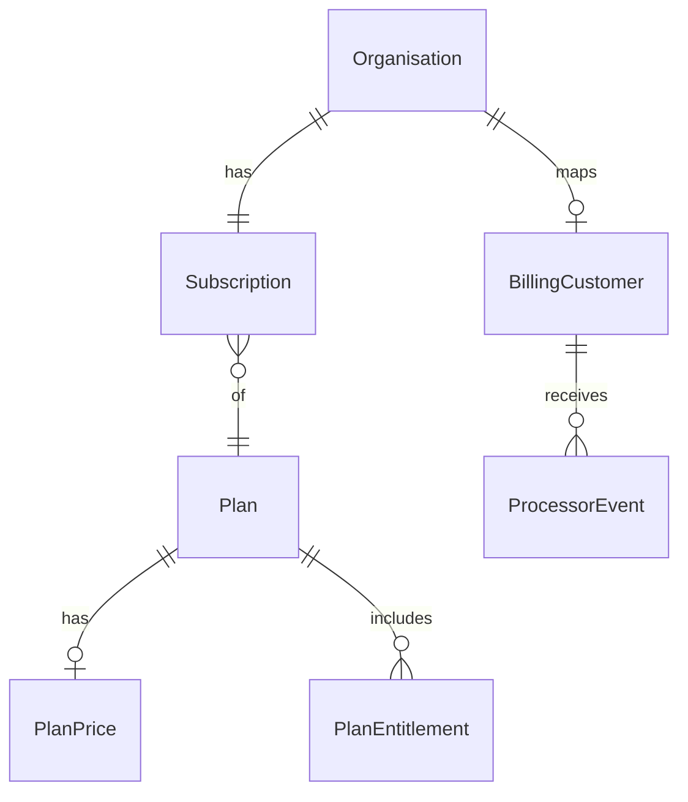

# Billing — Stripe executor (v1)

Status: **C0 implemented**.  
Context: Stripe executor behind KYC APIs; set `PAYMENTS_PROVIDER=stripe` plus `STRIPE_*` env to go live ([saas-rethink.md](./saas-rethink.md) gap #5).

## Goal

KYC is **not a payment processor**. It is a **strong implementor/executor** of Stripe’s APIs: checkout, portal, webhooks, and reconciliation — so companies can use KYC APIs instead of wiring Stripe themselves.

1. **KYC** is system of record for org → plan → entitlements / access.
2. **Stripe** is the money rail via a thin adapter; never the source of truth for product access.
3. Merchant-facing KYC billing APIs stay stable; adapter details can change underneath.

| We are | We are not |
| --- | --- |
| Executor of Checkout, Portal, Customers, Subscriptions | A payment processor or second Stripe |
| Webhook verify + idempotent reconcile → org subscription/entitlements | Invoicing, tax filing, payout, or card vault of our own |
| Stable KYC billing APIs companies call instead of Stripe SDK | Multi-PSP or Stripe Connect (v1) |

Companies integrate **KYC**; KYC integrates **Stripe**.

---

## How this helps KYC users

KYC users are organisations (and the people who run them) that already rely on KYC for members, roles, and entitlements. Billing v1 closes the loop: **pay → plan → access** without each company inventing Stripe plumbing.

| User | Without KYC billing | With KYC billing |
| --- | --- | --- |
| **Product / eng team** integrating KYC | Build Checkout, Portal, webhook verify, retries, and “paid → unlock feature” themselves | Call KYC checkout/portal APIs; trust webhooks are verified and reconciled into subscription state |
| **Org admin** (`billing:manage`) | Juggle Stripe Dashboard and KYC entitlements separately | Upgrade / manage payment method in-app; see plan and status next to the rest of org settings |
| **App runtime / API consumers** | Guess access from Stripe or stale flags | Check entitlements as today — paid state is already reflected on the org |
| **Platform / ops** | Manual spreadsheet comps and drift between Stripe and KYC | Comps via existing subscription upsert; Stripe remains source for real charges |

**Concrete wins**

1. **One integration surface** — Companies talk to KYC for org, authz, *and* billing actions. Stripe stays an implementation detail.
2. **Webhook burden lifted** — Signature verify, idempotency, and status mapping (`active` / `past_due` / `canceled`) live in KYC once, not in every customer app.
3. **Access stays consistent** — Entitlement checks do not call Stripe. After reconcile, “can this org use X?” has a single answer in KYC.
4. **Safer self-serve money UI** — Card entry and cancellation stay on Stripe Checkout/Portal (PCI); KYC only starts those sessions and shows outcomes.
5. **Less drift** — Org, plan, and payment status live together, so support and product logic stop disagreeing about who is paid.

**What users still do elsewhere**

- Configure Products/Prices in Stripe (KYC stores the Price id on the plan).
- Handle refunds, disputes, and tax filings in Stripe Dashboard (or later Stripe features) — KYC does not replace those tools.

---

## What input we need from users

v1 asks for very little at runtime. Most setup is one-time platform config; org admins mostly click and pay on Stripe-hosted pages.

### Platform / ops (one-time + catalog)

| Input | Why | Where |
| --- | --- | --- |
| Stripe secret key + webhook signing secret | KYC can call Stripe and verify events | Env (`STRIPE_*`) |
| Success / cancel URLs | Where Checkout returns the browser | Env or checkout request |
| Stripe Product + Price per sellable plan | What Checkout charges | Stripe Dashboard |
| Link Price id → KYC plan | KYC knows which plan a payment activates | `PlanPrice.processor_price_ref` |

No card data, bank details, or invoice templates — those stay in Stripe.

### Org admin (`billing:manage`) — self-serve

| Input | Required? | Notes |
| --- | --- | --- |
| Which plan to buy | **Yes** (checkout) | Plan id/key; KYC resolves the Stripe Price |
| Payment method | **Yes**, but collected by **Stripe Checkout**, not KYC | Cards never touch KYC |
| Billing email / name | Usually **no** | Default from acting user + org name when creating the Stripe Customer |
| Portal actions (update card, cancel) | On Stripe Portal | KYC only opens the session |

Typical checkout body: `{ "plan_id": "…" }` (optional success/cancel URL overrides). Portal: org id in the path, no body.

### Eng team integrating KYC APIs

| Input | Notes |
| --- | --- |
| Session (or principal) with `billing:manage` | Same auth as the rest of KYC |
| `plan_id` on checkout | Same as admin UI |
| Webhook URL in Stripe Dashboard | Points at `POST /v1/billing/webhooks/stripe` (platform configures once) |

They do **not** pass Stripe secrets, raw webhook payloads to parse themselves, or card fields through KYC.

### Derived automatically (no user form)

| Field | Source |
| --- | --- |
| Stripe Customer | Created/linked on first checkout from org + billing email |
| Subscription + status | From Stripe webhooks after pay / renew / fail / cancel |
| Entitlements | From KYC plan attached on reconcile |

---

## What we will build

A Stripe executor behind KYC APIs that reconciles paid state into the existing Plan → Subscription → Entitlements model. **Flat recurring plans only.**

| Deliverable | What it does |
| --- | --- |
| `PaymentsProcessor` port + `stripe` + `noop` adapters | EnsureCustomer, CreateCheckout, CreatePortal, webhook verify. `noop` for local/CI. |
| Org ↔ Stripe customer mapping | Store `processor` + `customer_ref` (and subscription ref). |
| Plan ↔ Stripe Price link | One flat recurring price per sellable plan (`processor_price_ref`). Catalog + entitlements stay in KYC. |
| Merchant APIs | `POST …/billing/checkout`, `POST …/billing/portal` (`billing:manage`). |
| Webhook endpoint | `POST /v1/billing/webhooks/stripe` — verify signature, idempotent inbox, apply status. |
| Reconciliation → access | Map events → `trialing` / `active` / `past_due` / `canceled` + plan on Subscription. Entitlement checks stay DB-only. |
| Merchant Billing UI | Plan/status/period; **Upgrade** → Checkout; **Manage** → Portal. |
| Platform escape hatch | Keep manual `PUT …/subscription` for comps / enterprise (audited). |

```text
Merchant → KYC checkout/portal APIs → Stripe
Stripe webhooks → KYC verify + reconcile → Subscription / Entitlements
Product checks → KYC entitlements only (never Stripe on hot path)
```

---

## Principles

| Principle | Meaning |
| --- | --- |
| Executor, not PSP | Call Stripe well; do not reimplement money movement, ledgers, or PCI. |
| Org is the billable entity | One billing customer per organisation. |
| Entitlements gate access | Handlers check platform capabilities / product features, not Stripe. |
| Catalog owns commercial intent | Plan key + entitlements (`platform` / `product` scope) in KYC; Price ID is a processor ref. |
| Processor owns money movement | Checkout, invoices, payment methods, dunning stay with Stripe. |
| Idempotent sync | Webhooks map to KYC subscription state with idempotency keys. |
| Soft coupling | Store opaque refs; core domain applies outcome commands, not raw Stripe enums. |

---

## Domain model (v1 additions)

Keep existing Plan / Entitlement / Subscription. Add only:



| Concept | Purpose |
| --- | --- |
| **PlanPrice** | Flat recurring offer: `interval`, `currency`, `unit_amount`, `processor_price_ref`. |
| **BillingCustomer** | Org ↔ processor customer mapping. |
| **ProcessorEvent** | Webhook inbox (`id`, `type`, processed_at) for idempotency. |

Subscription gains processor refs (`subscription_ref`, optional period end sync from Stripe).

```text
effective_entitlements = plan ∪ grants − denies
```

Failing payment → subscription status change → access policy. Never call Stripe inside entitlement checks.

---

## Payment processor interface

```go
// Conceptual — names illustrative
type PaymentsProcessor interface {
    EnsureCustomer(ctx, CustomerInput) (CustomerRef, error)
    CreateCheckout(ctx, CheckoutInput) (CheckoutSession, error)
    CreatePortal(ctx, PortalInput) (PortalSession, error)
}

type WebhookHandler interface {
    ParseAndVerify(headers, body) (ProcessorEvent, error)
}
```

| KYC (core) | Adapter (Stripe) | Out of band |
| --- | --- | --- |
| Plan catalog, entitlements | Product/Price IDs | Tax filings, chargebacks UI |
| Org subscription status | Checkout, Customer Portal | Refunds in Dashboard |
| Entitlement checks | Webhook signature verify | |
| Idempotent apply of remote state | Map Stripe objects ↔ refs | |

| Outcome command | Typical Stripe triggers |
| --- | --- |
| `CustomerLinked` | checkout completed |
| `SubscriptionActivated` | `checkout.session.completed`, `customer.subscription.created/updated` |
| `SubscriptionPeriodRenewed` | `invoice.paid` |
| `SubscriptionPastDue` | `invoice.payment_failed` |
| `SubscriptionCanceled` | `customer.subscription.deleted` |

```text
PAYMENTS_PROVIDER=stripe|noop
STRIPE_SECRET_KEY=
STRIPE_WEBHOOK_SECRET=
STRIPE_SUCCESS_URL=
STRIPE_CANCEL_URL=
```

Price IDs live on `PlanPrice.processor_price_ref`. `noop`: local/dev; set subscription via platform APIs.

---

## Stripe mapping

| KYC | Stripe |
| --- | --- |
| Organisation | Customer (`metadata.org_id`) |
| PlanPrice (flat) | Price (`recurring`) on Product |
| Self-serve subscribe/upgrade | Checkout Session (`mode=subscription`) |
| Manage card / cancel / invoices | Customer Portal |
| Truth for paid state | Webhooks → KYC Subscription |

- Create Products/Prices in Stripe; store Price IDs on `PlanPrice`.
- Prefer Checkout + Portal over custom card UI.
- Webhooks own paid state; manual `PUT …/subscription` is ops override only.

---

## APIs

Merchant (session + `billing:manage`):

- `POST /v1/organisations/{id}/billing/checkout` → `{ url }`
- `POST /v1/organisations/{id}/billing/portal` → `{ url }`

Platform:

- PlanPrice link (or seed); existing subscription upsert for comps / enterprise

Public:

- `POST /v1/billing/webhooks/stripe` — raw body, signature verify in adapter

---

## UX

| Surface | Behaviour |
| --- | --- |
| Merchant Billing | Plan, status, period end; **Platform capabilities** vs **Product features**; **Upgrade** → Checkout; **Manage** → Portal |
| Platform | Link Stripe price IDs; comps/overrides; reconcile stuck subs |
| Runtime | `entitlements/check` only — no Stripe on hot path |

---

## Decisions (v1 locked)

| Topic | Choice |
| --- | --- |
| Pricing shape | Flat recurring (monthly; annual price optional as second PlanPrice) |
| Who may change plan | `billing:manage` |
| Paid-state truth | Stripe webhooks; admin override with audit |
| Provider | Stripe adapter behind port; `noop` for CI |
| Price catalog | KYC `PlanPrice` + Stripe price id |
| Cancel | End of period via Portal default |

---

## Testing

| Layer | What |
| --- | --- |
| Domain | Status → access; entitlement math unchanged |
| Adapter | Stripe test fixtures; signed webhook samples |
| Integration | `noop` in CI |
| Idempotency | Replay same webhook → no double apply |

---

## Non-goals (v1)

- Being a payment processor
- Usage meters, overage, seat quantity billing
- Limits / usage dashboards
- Stripe Tax, coupons, multi-currency complexity
- Second PSP or Stripe Connect
- Replacing Stripe invoices, dunning, or Dashboard tools
