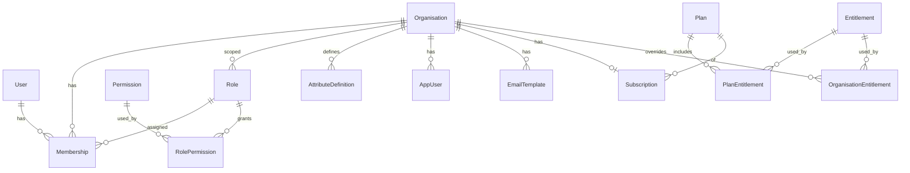

# Data model

KYC is the system of record for **organisations**, their **users**, **authorisation**, and **billing entitlements**.

## Entity relationship



## Naming

| Term people say | Stored as | Notes |
| --- | --- | --- |
| Merchant / tenant / business / workspace | **Organisation** | Hub entity |
| Person / login identity (KYC operator) | **User** | Global; many orgs via membership |
| Seat / team member | **Membership** | User ↔ organisation + role |
| End user / customer of the merchant app | **AppUser** | Org-scoped; schema-backed profile |
| Profile field definition | **AttributeDefinition** | Org-scoped; `section` for UI grouping |
| Message copy for app users | **EmailTemplate** | Org-scoped; system + custom keys |
| Billing account | Organisation + **Subscription** | No separate Account in v1 |

---

## Objects

### Organisation

Tenant hub. Everything else hangs off this record.

| Field | Type | Notes |
| --- | --- | --- |
| `id` | string (ULID/UUID) | PK |
| `name` | string | Display name |
| `slug` | string | Unique URL-safe identifier |
| `status` | enum | `active` \| `suspended` \| `archived` |
| `logo_url` | string | Public URL for email logo (set via upload) |
| `primary_color` | string | Hex `#RGB` / `#RRGGBB`; default `#1f4d3a` |
| `accent_color` | string | Optional hex for header title |
| `email_footer` | string | Footer text for branded email chrome |
| `email_font` | string | Legacy / body font key: `arial`, `helvetica`, `verdana`, `trebuchet`, `georgia`, `times`, `courier` |
| `email_typography` | jsonb | Per-region styles: `header` / `body` / `footer` each with `font`, `size`, `weight`, `style`, plus optional `text_color`, `background_color`, `text_align`, `padding_left` |
| `email_from_name` | string | Default From display name (empty → fall through to `EMAIL_FROM`) |
| `email_from_address` | string | Default From address (empty → fall through to `EMAIL_FROM`) |
| `app_user_authority` | enum | `kyc` (default) \| `external` — primary source for customer profiles; KYC UI create stays allowed either way |
| `app_user_ingest_upsert_key` | enum | `external_id` (default) \| `email` — which field ingest matches on |
| `app_user_attributes_mode` | enum | `discover` (default) \| `strict` — whether ingest auto-creates attribute definitions for unknown keys |
| `created_at` | timestamptz | |
| `updated_at` | timestamptz | |

Branding is applied at email **render/preview** time (`core/emailtemplates.Wrap`), not baked into each template body. A visual drag-and-drop builder is deferred.

When `app_user_authority=external`, KYC is a **projection** of merchant customers (ingest is the happy path). Manual create/edit in KYC remains available as an override.

### User

Global person. Email is unique across the system.

| Field | Type | Notes |
| --- | --- | --- |
| `id` | string | PK |
| `email` | string | Unique |
| `name` | string | |
| `status` | enum | `active` \| `disabled` |
| `created_at` | timestamptz | |
| `updated_at` | timestamptz | |

### Membership

Links a user to an organisation with a role.

| Field | Type | Notes |
| --- | --- | --- |
| `id` | string | PK |
| `organisation_id` | string | FK → Organisation |
| `user_id` | string | FK → User |
| `role_id` | string | FK → Role |
| `status` | enum | `invited` \| `active` \| `revoked` |
| `created_at` | timestamptz | |

Unique `(organisation_id, user_id)`.

### Role

Organisation-scoped. System roles are seeded at signup.

| Field | Type | Notes |
| --- | --- | --- |
| `id` | string | PK |
| `organisation_id` | string | FK → Organisation |
| `key` | string | e.g. `owner`, `admin`, `member` |
| `name` | string | Display name |
| `description` | string | Optional |
| `is_system` | bool | Seeded roles are not deletable |

Unique `(organisation_id, key)`. Default system roles: `owner`, `admin`, `member`.

### Permission

Global catalog of what a **user** may do inside an organisation (RBAC). Not the same as Entitlement.

> How permissions are evaluated at runtime, and the proposed grant model that replaces this shape, are in [access-control.md](access-control.md).

| Field | Type | Notes |
| --- | --- | --- |
| `id` | string | PK |
| `key` | string | Unique; conventionally `{resource}:{action}` |
| `resource` | string | e.g. `members`, `billing` |
| `action` | string | e.g. `invite`, `manage` |
| `category` | string | Admin UI grouping: `Access`, `Billing`, `Admin` |
| `description` | string | Human explanation |
| `is_system` | bool | Seeded; key/resource/action immutable |

Constraints: unique `key`; unique `(resource, action)`.

#### Seed catalog (v1)

| key | resource | action | category |
| --- | --- | --- | --- |
| `organisation:read` | organisation | read | Admin |
| `organisation:update` | organisation | update | Admin |
| `members:read` | members | read | Access |
| `members:invite` | members | invite | Access |
| `members:remove` | members | remove | Access |
| `roles:read` | roles | read | Access |
| `roles:manage` | roles | manage | Access |
| `billing:read` | billing | read | Billing |
| `billing:manage` | billing | manage | Billing |
| `attributes:read` | attributes | read | Users |
| `attributes:manage` | attributes | manage | Users |
| `app_users:read` | app_users | read | Users |
| `app_users:write` | app_users | write | Users |
| `email_templates:read` | email_templates | read | Messaging |
| `email_templates:manage` | email_templates | manage | Messaging |
| `api_keys:read` | api_keys | read | Admin |
| `api_keys:manage` | api_keys | manage | Admin |

### APIKey

Machine credentials for calling KYC. Platform keys have null `organisation_id`; org keys are scoped to one tenant. Raw tokens are never stored (SHA-256 hash + prefix only).

| Field | Type | Notes |
| --- | --- | --- |
| `id` | string | PK |
| `name` | string | Label for operators |
| `key_prefix` | string | First characters for UI identification |
| `key_hash` | string | Unique SHA-256 hex of raw token |
| `organisation_id` | string? | Null = platform key; set = org-scoped service principal |
| `scopes` | text[] | RBAC permission keys; empty = full org access |
| `last_used_at` | timestamptz? | Updated on successful Bearer auth |
| `created_at` | timestamptz | |
| `revoked_at` | timestamptz? | Soft revoke; excluded from auth lookup |

Org keys require the organisation `api_access` entitlement to create and to authenticate.

### OrganisationOnboarding

UI state for the Overview “Getting started” checklist. Step completion is derived from organisation data; this table only stores dismiss.

| Field | Type | Notes |
| --- | --- | --- |
| `organisation_id` | string | PK, FK → Organisation |
| `dismissed_at` | timestamptz? | Set when an admin dismisses the panel |
| `updated_at` | timestamptz | |

### AttributeDefinition

Org-scoped schema for end-user profile fields. Used by the merchant UI to group inputs via `section`.
System defaults (`phone`, `location`, `country`, `date_of_birth`, `address_line1`, `city`, `postal_code`) are seeded per org (`core/userattributes`); `display_name` / `email` remain AppUser columns.

| Field | Type | Notes |
| --- | --- | --- |
| `id` | string | PK |
| `organisation_id` | string | FK → Organisation |
| `key` | string | Machine key; unique per org |
| `label` | string | Display label |
| `description` | string | |
| `value_type` | enum | `string` \| `number` \| `boolean` \| `date` \| `dropdown` |
| `section` | string | UI group (default `general`) |
| `sort_order` | int | Order within section |
| `required` | bool | |
| `enum_values` | jsonb | Allowed options when `value_type` is `dropdown` |
| `is_pii` | bool | |
| `is_system` | bool | Seeded defaults; editable/deletable like custom attrs |
| `status` | enum | `active` \| `archived` |

### AppUser

Org-scoped end user (subject of the schema). Not a Membership / login identity for KYC.

| Field | Type | Notes |
| --- | --- | --- |
| `id` | string | PK |
| `organisation_id` | string | FK → Organisation |
| `external_id` | string? | Merchant-side id |
| `email` | string? | Unique per org when set |
| `display_name` | string | |
| `status` | enum | `active` \| `disabled` \| `archived` |
| `attributes` | jsonb | Profile values keyed by attribute `key` |

Monitoring / observations are intentionally separate (not this table).

### EmailTemplate

Org-scoped email copy for messaging app users. Seeded system templates per org; custom keys allowed. Domain logic: `core/emailtemplates`.

| Field | Type | Notes |
| --- | --- | --- |
| `id` | string | PK |
| `organisation_id` | string | FK → Organisation |
| `key` | string | Unique per org; locked when `is_system` |
| `name` | string | Display label |
| `description` | string | |
| `subject` | string | Supports `{{path}}` placeholders (shared `app_user.*` / `organisation.name` vocabulary) |
| `body_text` | string | Plain text body |
| `body_html` | string | Legacy/synced concatenation of section HTML (prefer `body_sections`) |
| `body_sections` | jsonb | Ordered sections: `{ id, content_html, style? }` — style inherits org body defaults |
| `from_name` | string | Optional From name override (empty → org default) |
| `from_address` | string | Optional From address override (empty → org default) |
| `status` | enum | `active` \| `archived` |
| `is_system` | bool | Seeded defaults |

Default keys: `welcome`, `payment_thank_you`, `profile_incomplete`.

### Automation

Org-scoped rule (trigger + conditions + actions). Domain: `core/automations`. Runs via River jobs.

| Field | Type | Notes |
| --- | --- | --- |
| `id` | string | PK |
| `organisation_id` | string | FK → Organisation |
| `name` | string | Optional label |
| `trigger` | string | e.g. `app_user.created` |
| `enabled` | bool | |
| `conditions` | jsonb | `{ "all": [{ field, op, value? }] }` |
| `actions` | jsonb | `[{ "type": "send_email", "params": { "template_key": "welcome" } }]` |

### AutomationRun

Execution log for one automation against one event.

| Field | Type | Notes |
| --- | --- | --- |
| `id` | string | PK |
| `organisation_id` | string | FK → Organisation |
| `automation_id` | string | FK → Automation |
| `trigger` | string | |
| `status` | enum | `success` \| `skipped` \| `error` |
| `detail` | string | Human-readable outcome |
| `payload` | jsonb | Event snapshot |

### RolePermission

Join: Role ↔ Permission (many-to-many).

| Field | Type |
| --- | --- |
| `role_id` | FK → Role |
| `permission_id` | FK → Permission |

### Plan

Billing catalog entry.

| Field | Type | Notes |
| --- | --- | --- |
| `id` | string | PK |
| `key` | string | Unique, e.g. `free_plan`, `pro` |
| `name` | string | |
| `status` | enum | `active` \| `archived` |

### Entitlement

Catalog of named capabilities an **organisation** may hold. Global rows (`organisation_id` null) are platform-owned; org-owned rows are **product features**. Not the same as Permission.

Each entitlement has a **scope**:

| Scope | UI label | Meaning |
| --- | --- | --- |
| `platform` | Platform capabilities | Features of KYC itself (e.g. `sso`, `api_access`) |
| `product` | Product features | Features the customer unlocks in their own app (e.g. `premium_reports`) |

| Field | Type | Notes |
| --- | --- | --- |
| `id` | string | PK |
| `key` | string | Unique, e.g. `sso`, `premium_reports` |
| `description` | string | |
| `scope` | enum | `platform` \| `product` |
| `organisation_id` | string? | Null = global (platform) catalog; set = org-owned **product** feature |
| `enabled` | bool | Kill switch (product features; ignored at check for platform) |
| `rollout_percentage` | int | 0–100 progressive rollout among entitled end users (product features) |

### ProductFeatureOverride

Force include/exclude a subject for an org-owned product feature regardless of percentage.

| Field | Type | Notes |
| --- | --- | --- |
| `entitlement_id` | string | FK → Entitlement (product scope) |
| `subject_id` | string | Opaque id from merchant product (e.g. app user external id) |
| `effect` | enum | `include` \| `exclude` |

Runtime check: `POST /v1/entitlements/check` with `{ organisation_id, entitlement, subject_id? }` after plan entitlement passes.

### OrganisationWebhook

Outbound HTTP endpoint used by the `call_webhook` automation action. Secret is stored server-side and returned only as a hint.

| Field | Type | Notes |
| --- | --- | --- |
| `id` | string | PK |
| `organisation_id` | string | FK → Organisation |
| `name` | string | Display label |
| `url` | string | http(s) endpoint |
| `secret` | string | Optional shared secret header value |
| `body_template` | string | JSON with `{{app_user.*}}` placeholders; empty = full event dump |
| `status` | enum | `connected` \| `disconnected` |

### OrganisationDatabase

Postgres connection used by the `db_insert` automation action. Password is stored server-side and returned only as a hint.

| Field | Type | Notes |
| --- | --- | --- |
| `id` | string | PK |
| `organisation_id` | string | FK → Organisation |
| `name` | string | Display label |
| `driver` | enum | `postgres` (v1) |
| `host` / `port` / `database_name` / `username` / `password` | | Connection |
| `ssl_mode` | string | Default `require` |
| `status` | enum | `connected` \| `unreachable` \| `disconnected` — set by connectivity probe (or manual disconnect) |
| `last_checked_at` | timestamptz? | Last probe time |
| `last_error` | string | Probe error when `unreachable` |

### ProductPlan

Org-owned package of product features for end-user gating (separate from KYC billing `Plan`). Optional Stripe Product/Price sync via org integration keys.

| Field | Type | Notes |
| --- | --- | --- |
| `id` | string | PK |
| `organisation_id` | string | FK → Organisation |
| `key` | string | Unique per org |
| `name` | string | |
| `status` | enum | `active` \| `archived` |

### ProductPlanPrice

Flat recurring offer for a merchant product plan. KYC authors amount/interval; when Stripe is connected, Product/Price are created and refs stored.

| Field | Type | Notes |
| --- | --- | --- |
| `id` | string | PK |
| `product_plan_id` | string | FK → ProductPlan |
| `interval` | enum | `month` \| `year` |
| `currency` | string | e.g. `usd` |
| `unit_amount` | int64 | Minor units (cents) |
| `processor` | string | e.g. `stripe` |
| `processor_product_ref` | string | Stripe Product id (empty until synced) |
| `processor_price_ref` | string | Stripe Price id (empty until synced) |
| `status` | enum | `active` \| `archived` |

### ProductPlanFeature

Join: ProductPlan ↔ Entitlement (org product features only).

### OrganisationProductPlan

Which product plan is active for the organisation’s end users.

| Field | Type | Notes |
| --- | --- | --- |
| `organisation_id` | string | PK, FK → Organisation |
| `product_plan_id` | string | FK → ProductPlan |

**Effective entitlements** = KYC plan entitlements ∪ active product plan features ∪ grants − denies.

### PlanEntitlement

Join: Plan ↔ Entitlement.

| Field | Type |
| --- | --- |
| `plan_id` | FK → Plan |
| `entitlement_id` | FK → Entitlement |

### PlanPrice

Flat recurring offer linked to a PSP Price id. See [billing-plans.md](./billing-plans.md).

| Field | Type | Notes |
| --- | --- | --- |
| `id` | string | PK |
| `plan_id` | string | FK → Plan |
| `interval` | enum | `month` \| `year` |
| `currency` | string | e.g. `usd` |
| `unit_amount` | int64 | Minor units (cents) |
| `processor` | string | e.g. `stripe`, `noop` |
| `processor_price_ref` | string | Stripe Price id |
| `status` | enum | `active` \| `archived` |

### BillingCustomer

Org ↔ PSP customer mapping.

### ProcessorEvent

Idempotent webhook inbox (`processor` + `event_ref` unique).

### Subscription

Attaches a plan to an organisation. One active subscription per organisation in v1.

| Field | Type | Notes |
| --- | --- | --- |
| `id` | string | PK |
| `organisation_id` | string | FK → Organisation |
| `plan_id` | string | FK → Plan |
| `status` | enum | `trialing` \| `active` \| `past_due` \| `canceled` |
| `current_period_end` | timestamptz | Nullable |
| `processor` | string? | e.g. `stripe` |
| `subscription_ref` | string? | PSP subscription id |

### OrganisationEntitlement

Per-org overrides on top of KYC plan + active product plan.

| Field | Type | Notes |
| --- | --- | --- |
| `organisation_id` | string | FK → Organisation |
| `entitlement_id` | string | FK → Entitlement |
| `effect` | enum | `grant` \| `deny` |

---

## Permission vs Entitlement

| | Permission | Entitlement |
| --- | --- | --- |
| Subject | User (via role) | Organisation (via plan) |
| Answers | “May Ada invite members?” | “May Acme use this capability?” |
| Example | `members:invite` | `sso` (platform), `premium_reports` (product) |

| Entitlement scope | Answers |
| --- | --- |
| Platform capability | “May Acme use SSO / this KYC feature?” |
| Product feature | “May Acme unlock this feature in its own product?” |

Product services often need both permission and entitlement:

```text
allowed = org_has_entitlement("sso") && user_has_permission("roles:manage")
```

Progressive delivery for product features uses rollout on the same entitlement key:

```text
allowed = entitlement_check("premium_reports", subject_id)
```

---

## Out of scope for v1

- Separate Account entity (billing ≠ operating org)
- Object-level ACL / ABAC
- Org-defined custom permissions (catalog is system-seeded)
- CRM pipeline / deals
