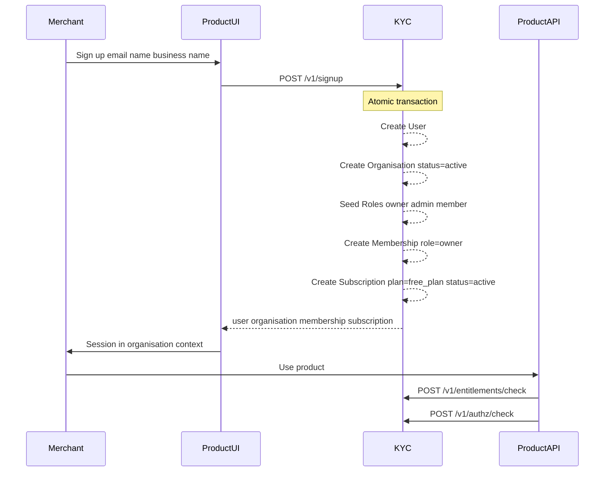

# Flows

Related: [access control](access-control.md) · [data model](data-model.md) · [api](api.md) · [README — How merchants integrate](../README.md#how-merchants-integrate)

## What “create an account” means

Creating an account = create **User + Organisation + owner Membership** (+ usually a **Subscription** on `free_plan`).

After signup, “account settings” is the Organisation record plus the user’s Memberships. Switching orgs = switching Organisation context among memberships.

---

## Self-serve signup (happy path)

Primary path: product UI → KYC API.

### Steps (one DB transaction)

1. Create **User** (`status=active`), or reuse if email exists and policy allows creating another org while logged in.
2. Create **Organisation** (`status=active`).
3. Seed system **Roles**: `owner`, `admin`, `member` with default permissions.
4. Create **Membership** (user → org, role=`owner`, `status=active`).
5. Upsert **Subscription** to plan `free_plan` (`status=active`).
6. Return `{ user, organisation, membership, subscription }`.

Require `Idempotency-Key` so double-submit does not create two organisations.

---

## Variants

| Flow | Who | What happens |
| --- | --- | --- |
| Self-serve signup | Merchant | `POST /v1/signup` |
| Create another org | Existing user | `POST /v1/organisations` + owner membership |
| Invite teammate | Owner/admin | Membership `invited` → accept → `active` |
| Ops-provisioned | Internal ops | Same objects via ops UI / APIs (no `/signup`) |
| Suspend / offboard | Ops or billing | Org `suspended` / membership `revoked`; checks fail |

---

## Invite teammate

1. Owner/admin calls `POST /v1/organisations/{id}/memberships` with `{ email, role_id }`.
2. Membership created with `status=invited` (user shell created if email unknown).
3. Invitee opens invite link and authenticates (IdP later; v1 may stub).
4. `POST /v1/memberships/{id}/accept` → `status=active`.
5. Product services use `authz/check` with the new membership’s role.

---

## Ops-provisioned organisation

Used when sales/ops onboard a merchant manually:

1. `POST /v1/organisations`
2. `POST /v1/users` (if needed)
3. Seed or create roles (or call an internal helper equivalent to signup seeding)
4. `POST /v1/organisations/{id}/memberships` with `status=active` (ops may skip invite)
5. `PUT /v1/organisations/{id}/subscription`

Same data model as self-serve; different entrypoint.

---

## Product runtime checks

When a merchant uses the product:

1. Resolve session → `user_id` + current `organisation_id`.
2. `POST /v1/entitlements/check` — is the org allowed this platform capability or product feature? For product features with partial rollout, include `subject_id` (end-user id) to evaluate percentage buckets and overrides.
3. `POST /v1/authz/check` — is this user allowed this action?

Entitlement + role must pass when a feature is gated by plan **and** role. Rollout controls gradual release among entitled end users on the same feature key.
