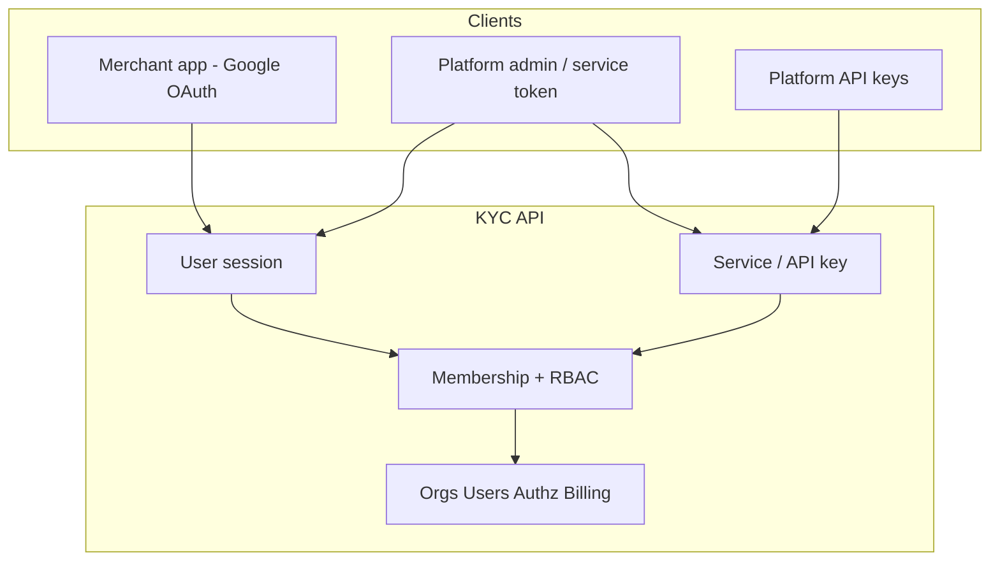

# SaaS rethink — status and roadmap

KYC is a **system of record for organisations**: orgs, users, memberships, RBAC, plans/entitlements, and check APIs — with **Google OAuth login**, **session auth**, and **membership tenancy** so people can use it as a multi-tenant product app.

## Product boundary (decided)

| In scope | Out of scope (for now) |
| --- | --- |
| **Login to KYC** — humans authenticate to use *this* app | **Auth-as-a-service for customers** — selling login/SSO for *their* apps |
| Sessions + membership tenancy + org RBAC | Being Auth0/Clerk for third parties |
| Service/API keys for platform & integrations | Payment processing (Stripe is next) |

## What we keep (core that still holds)

| Piece | Why |
| --- | --- |
| Organisation as tenant hub | Multi-tenant B2B model |
| Global User + Membership | Multi-org users |
| Roles / Permissions vs Entitlements | Who can act vs what the org paid for |
| `authz/check` + `entitlements/check` | Runtime gating primitives |
| Postgres + Go + sqlc | Fine for SaaS |

## Current architecture

**Request pipeline:** authenticate (session or service) → resolve principal → require org membership (unless platform) → require permission → handler.

---

## Gap checklist

| # | Topic | Status | Notes |
| --- | --- | --- | --- |
| 1 | App login / sessions | **Done** | Google OAuth → `kyc_sess_…`; `GET /v1/me`; logout. Dev-login for local/tests only. |
| 2 | Tenancy / authz hole | **Done** | Org routes require active membership; lists scoped to user’s orgs; RBAC on mutations; **403** when denied. |
| 3 | Merchant vs ops UI | **Partial** | Login-gated merchant UI (orgs, members, roles, billing read). No separate platform-admin console yet. |
| 4 | Auth model | **Done** | Humans = Google session. Machines = `API_TOKENS` / DB API keys (platform). |
| 5 | Real billing | **Partial** | Stripe executor (Checkout/Portal/webhooks → subscription). See [billing-plans.md](./billing-plans.md). Metering / Connect later. |
| 6 | Invite email | **Partial** | Invite + accept-while-logged-in works; no email delivery or magic invite links. |
| 7 | Platform admin | **Partial** | `platform_admin` flag + `PLATFORM_ADMIN_EMAILS`; no dedicated admin UI. |
| 8 | Production essentials | **Partial** | Auth/check rate limits, mutation audit. Still missing: email provider, merchant-scoped API keys, GDPR export/delete, hardened cookie sessions, etc. |
| 9 | Name vs product | **Open** | Still “KYC” without ID verification — position as org/access/billing platform, or add real KYC later. |

---

## Roadmap

### Phase A — App login + multi-tenant safety — **done**
- Google OAuth (no passwords)
- Sessions, `GET /v1/me`, logout
- Membership tenancy + RBAC on org routes
- Platform/service principals for catalog, API keys, audit
- Login-gated UI

### Phase B — Merchant product polish
- Invite emails + clearer accept flow
- Org switcher UX
- Team / roles / billing screens refined for merchants (not ops)
- **App users + attribute schema** (org-scoped end users; definitions with `section` grouping) — **done (v1)**
- **Email templates** (org-scoped catalog + `core/emailtemplates`; no send yet) — **done (v1)**
- **Org email branding** (logo upload, colors, footer chrome at render time; visual builder deferred) — **done (v1)**
- **Automations** (org rules UI: simple conditions + action list; River on Postgres) — **done (v1)**; see [automations.md](automations.md)

### Phase C — Real billing — **C0 done (executor)**
- Stripe Customer per org, Checkout, Portal, webhooks → Subscription / Entitlements ([billing-plans.md](./billing-plans.md))

### Phase D — Platform admin
- Separate admin surface for `platform_admin` (support, plan catalog, impersonation)

### Phase E — Production hardening
- Turn off `AUTH_DEV_LOGIN` in prod; secure cookie option for sessions
- Merchant-scoped API keys, observability, backups, delete/export

### Phase F — Optional later
- Auth services for customers (if we sell that)
- True KYC / identity verification entitlement
- CRM-lite, SSO/SAML for enterprise

---

## Operating rules

- Do not ship human-facing features that assume a god-mode Bearer token.
- Do not build “auth for our customers’ users” before finishing merchant product + billing.
- Production: require Google OAuth credentials; disable `AUTH_DEV_LOGIN`.
